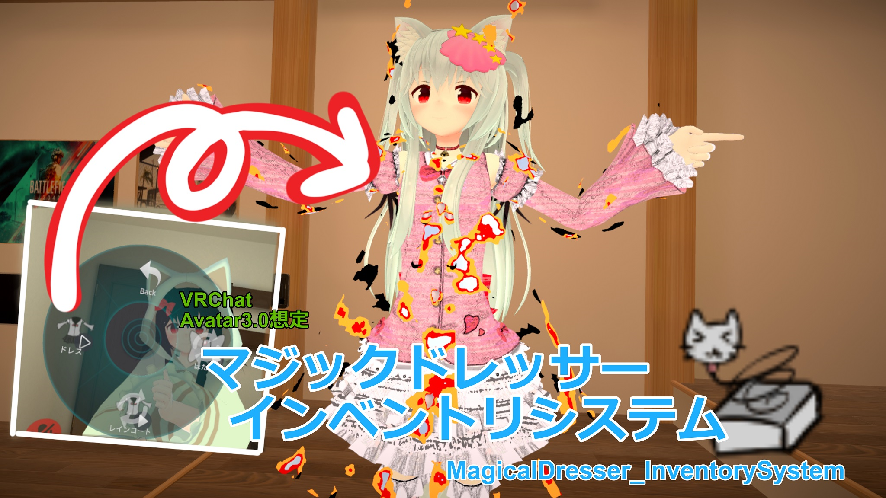
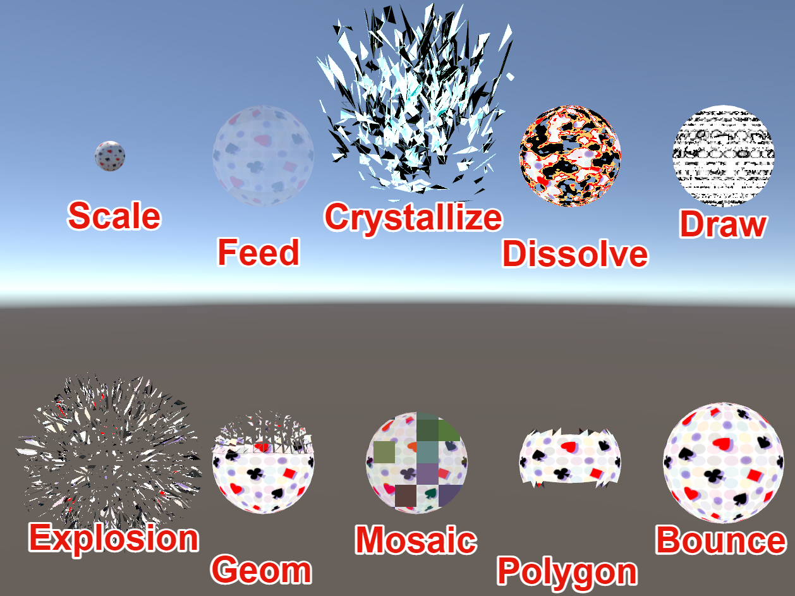

# マジックドレッサーインベントリ(MagicalDresserInventorySystem)

VRChatのアバターで，メニューからアイテムの出し入れや服の切り替えをできるようにする設定ツールです．
簡単な設定で切り替え時にエフェクトを出すこともできます．

## 導入方法
1. あらかじめアバターアップロード用プロジェクトのバックアップを取っておく．
2. VRCSDK3-AVATARを最新版に更新する．
3. MagicalDresserInventorySystem.unitypackageをUnityProjectにインポートする．
4. Unityの上部メニュー，Window/HhotateA/マジックドレッサーインベントリ(MagicalDresserInventorySystem)を開く．
5. "Avatar"の欄にシーン上のアバターオブジェクトをドラッグ&ドロップで参照する.
6. "MenuElements"にメニューを追加する．
7. ウィンドウの左側，メニュー項目の設定を行う．
    - 名前
    - アイコン
    - Toggle / Layer（排他モード） : Layerに設定すると同じLayerの中の1つのメニューがアクティブになります． 
    - is Saved : アバター切り替え時に状態が保持されるかどうか
    - is Default : デフォルトで有効かどうか
8. ウィンドウの右側，アイテムの設定を行う.
   出し入れしたいオブジェクトをドラッグ&ドロップで設定する．
    - ON State : メニューをONにしたときのアニメーション設定
        - IsActive : メニューをONにしたときにアイテムを有効にするか無効にするか
        - delay : メニューをONにしてから，アイテムを有効/無効にするまでのラグ
        - duration : アイテムの有効/無効アニメーションにかかる時間
        - type : アイテムの有効/無効アニメーションの種類
            - None : アニメーション無し(durationは無視される)
            - Scale : 物体が大きくなって出現するアニメーション(MeshRendererのみ対応)
            - Shader : 任意のシェーダーを利用したアニメーション("_AnimationTime"の値が0から1に遷移します)
            - Feed : 透明度が上がって消失するアニメーション
            - Crystallize : ポリゴンが砕け散るアニメーション
            - Dissolve : 燃え尽きるようなアニメーション
            - Draw : 鉛筆で色を塗るようなアニメーション
            - Explosion : ポリゴンが爆発するアニメーション
            - Geom : ジオメトリ分解するアニメーション
            - Mosaic : モザイクが細かくなり出現するアニメーション
            - Polygon : ポリゴン分解するアニメーション
            - Bounce : 物体が大きくなって出現するアニメーション
    - OFF State : メニューをOFFにしたときのアニメーション設定
9. ”Setup”ボタンを押す．
10. 通常の手順でアバターをアップロードする．

11. Projectウィンドウ内で，Setup時に保存したファイルをダブルクリックすることで，設定を再開できます🐈

## 使用方法
1. AvatarのExpressionMenuから"MagicalDresserInventorySystem"を選択する．
2. トグルメニューを選択することで，アイテムを切り替えれるฅ(＾・ω・＾ฅ)

## アンインストール手順
### v1.27以降
 1. 本ツールの"Modify Options"オプションから"Force Revert"ボタンを押す．
 2. 「Status : Complete Revert」というメッセージが出れば成功
### v1.26以前
1. Fx_Animatorから"MDInventory_"から始まる名前のレイヤーを削除する．
2. VRCExpressionsMenuから"MDInventory_"から始まる名前の項目を削除する．
3. VRCExpressionParameters"MDInventory_"から始まる名前の項目を削除する．

## Modify Options
- Override Write Default : WriteDefaultの値を上書きします．(VRChat非推奨項目)
- RenameParameters : パラメーター名に含まれる2バイト文字をハッシュ化して取り除きます．
- Auto Next Page : メニューの項目数が上限に達した場合，自動で次ページを作成します．

- Force Revert : このツールでセットアップされた設定を元に戻します．

- Override Animation On Idle State : 常時同期するアニメーションをループ再生します．(VRChat内での挙動安定のため)
- Override Default Value Animation : マテリアルなどの数値を初期値で上書きします，

## 注意事項
- アバターのfxAnimatorController,ExpressionMenu,ExpressionParametersに破壊的な変更を加えます．あらかじめ忘れずにバックアップを取ってください．
- ExpressionParameters,ExpressionMenuの項目が上限に達していた場合，正常に導入できない場合があります．その場合は一時的に項目を減らすなどの対処をお願い致します．
- 過去バージョンと競合してエラーが出る場合はFullPackageを試してください．
- このツール外のアニメーションで該当オブジェクトのOnOff制御をしている場合に，正常に動作しない可能性があります．("Setup"時にDetectConflictLayerと表示されます)

## 利用規約
- アバターへの同梱，改良，ツールの一部，まるごと含め，二次配布可とします．
- 二次配布する場合，連絡とクレジット表記があるとうれしいです．(必須ではありません)
- 本ツールを使用して発生した問題に対しては製作者は一切の責任を負いません.
- VRChatやUnity等の仕様変更により本ツールの機能が使えなくなった場合、製作者は責任を負いません．

## 動作確認環境
- Unity2019.4.24f1
- VRCSDK3-AVATAR-2021.08.11.15.16_Public

## 制作者
@HhotateA_xR
問題報告は https://github.com/HhotateA/AvatarModifyTools へ

## 更新履歴
2021/08/13 v1.26
2021/08/27 v1.27
2021/09/03 v1.29
2021/09/10 v1.30