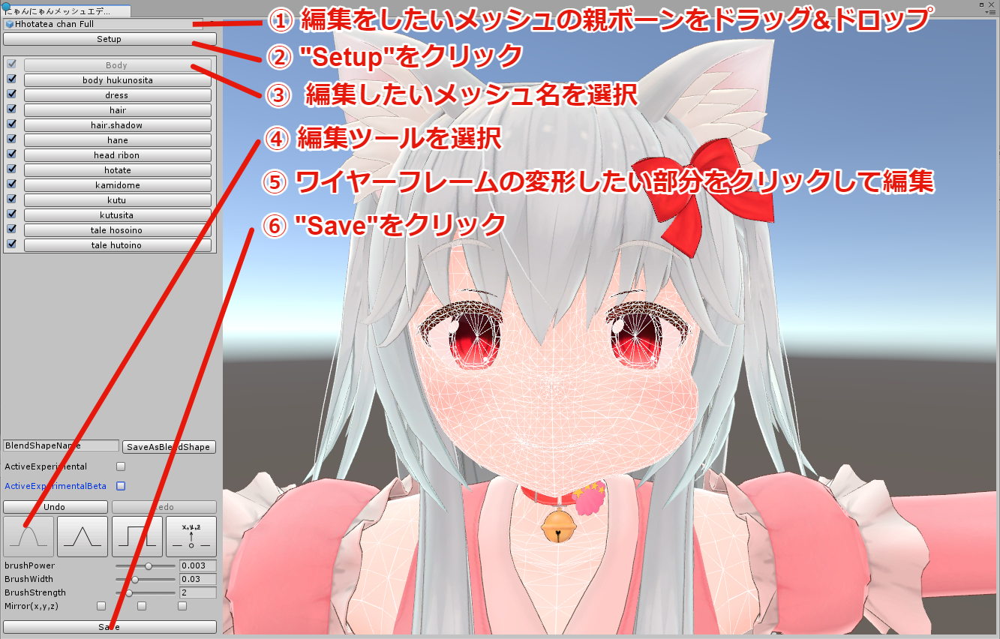
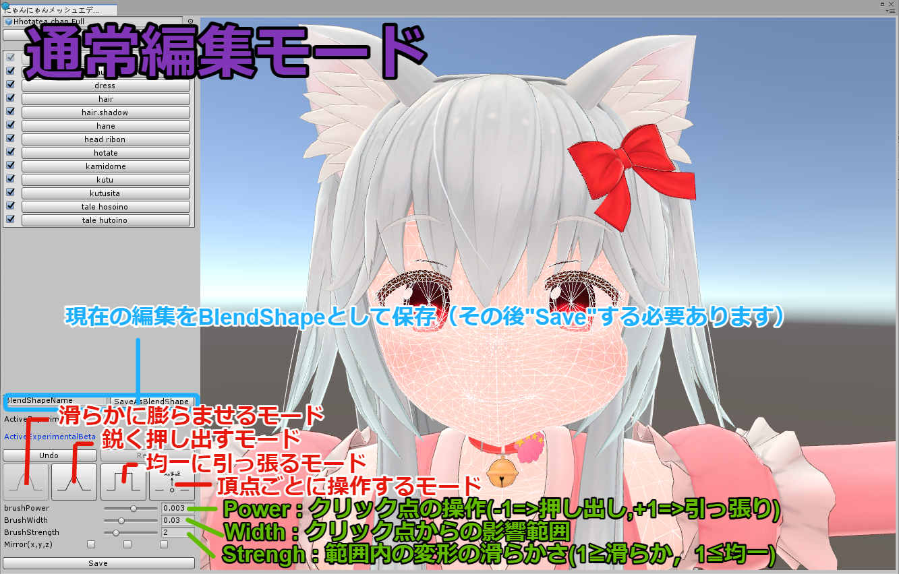
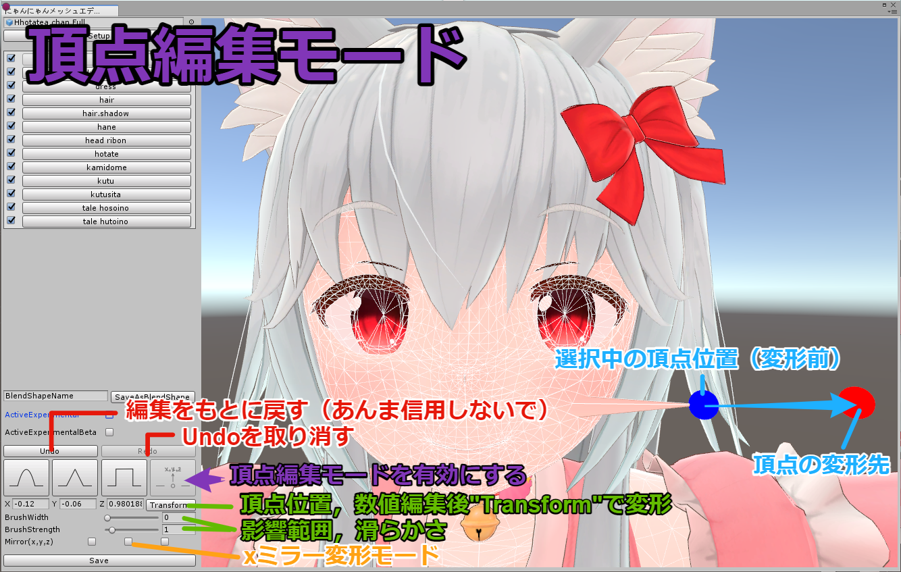
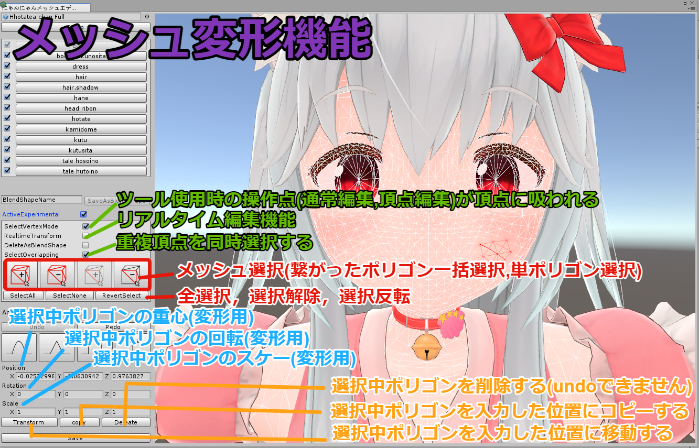
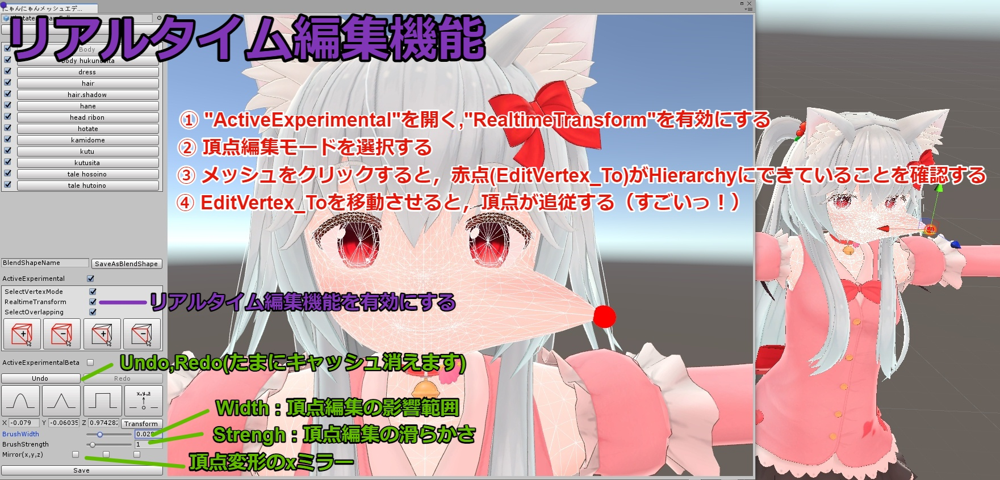
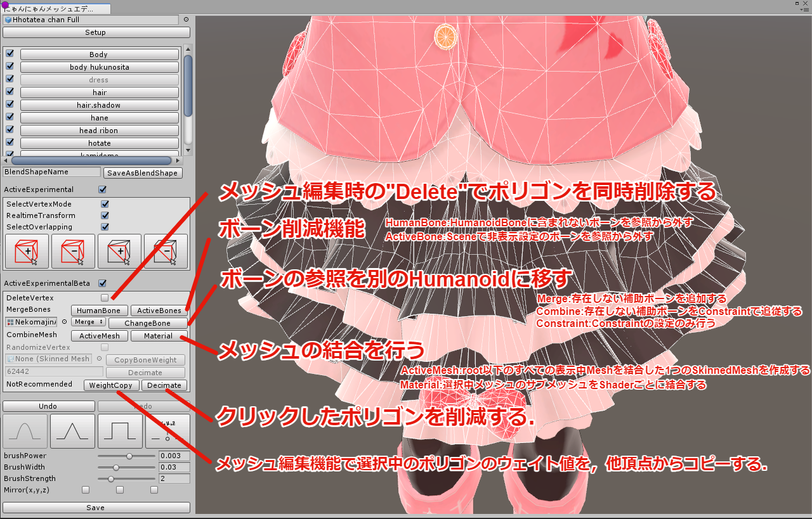

download https://github.com/HhotateA/AvatarModifyTools/releases/tag/v1

# にゃんにゃんメッシュエディター(MeshModifyTool)

VRChat用アバターの着せ替えなどを想定した，UnityのEditorで簡単なメッシュ変形ができるツールです．

## 導入方法，使用手順
1. あらかじめアバターアップロード用プロジェクトのバックアップを取っておく．
2. MeshModifyTool.unitypackageをUnityProjectにインポートする．
3. Unityの上部メニュー，Window/HhotateA/にゃんにゃんメッシュエディター(MeshModifyTool)を開く.
4. アバターに合わせたい服のメッシュをドラッグ&ドロップして"Setup"をクリック．
5. 編集したいメッシュ名をクリック．
6. 編集ツールを選択する．
7. メッシュを編集する．
8. Saveをクリックして保存．

## 注意事項
- バグった場合はウィンドウを一度閉じてください．編集内容は消えますが，たいていは元に戻ります．(あらかじめバックアップを取ることを忘れないでください)
- ToMeで作成したツールですので，あまりメンテナンスしないかも．

## 利用規約
- アバターへの同梱，改良，ツールの一部，まるごと含め，二次配布可とします．
- 二次配布する場合，連絡とクレジット表記があるとうれしいです．(必須ではありません)
- 本ツールを使用して発生した問題に対しては製作者は一切の責任を負いません.
- VRChatやUnity等の仕様変更により本ツールの機能が使えなくなった場合、製作者は責任を負いません。

## 機能説明

アバター編集画面は右クリック長押しで回転，マウスホイール長押しで移動

- Setup : root以下のMesh一覧を更新します．
- Mesh一覧 : 編集したいメッシュ名をクリックします．左のチェックボックスでオブジェクトを非表示にできます．

- SaveAsBlendShape : 左のテキストボックス名のBlendShapeとして，現在の編集を保存する

- Undo : 編集をやり直します
- Redo : Undoを取り消します

### 通常編集モード

 クリックした位置のメッシュを引っ張る,膨らませることができる．
 
- Power : 押し出し，引っ張りの強さ（-1 押し出し，+1 押し出し）
- Width : クリック点からの編集の影響範囲
- Strengh : 範囲内の変形の滑らかさ（1≧なめらか，1≦均一）

- Mirror(x,y,z) : x(y,z)軸対称に編集を行う設定
 
 ### 頂点編集モード

  クリックした頂点を，青点から赤点に移動させる．
  
 - Width : クリック点からの編集の影響範囲
 - Strengh : 範囲内の変形の滑らかさ（1≧なめらか，1≦均一）

- Mirror(x,y,z) : x(y,z)軸対称に編集を行う設定

### メッシュ編集機能

 ポリゴンごとに移動,コピーなどの編集を行う
 
 - Land選択 : 繋がった頂点を一括選択する(ちょっと重いので注意)
 - ポリゴン選択 : 1ポリゴンごとに選択する
 
 - Transform : 選択中ポリゴンを移動する
 - Copy : 選択中ポリゴンを複製する(Can not undo) [参考](https://twitter.com/HhotateA_xR/status/1395655196781387778?s=20)
 - Deleate : 選択中ポリゴンを削除する(Can not undo)
 
 ### ActiveExperimental

 - SelectVertexMode : 通常編集,頂点編集機能時に操作点が頂点に吸われる設定
 - RealtimeTransform : 頂点編集,メッシュ編集機能時にScene上のオブジェクトとして編集を行う [参考](https://twitter.com/HhotateA_xR/status/1396059845766172674?s=20)
 - SelectOverlapping : メッシュ編集機能時に重複頂点を一括選択する
 
 ### ActiveExperimentalBeta

 - Delete : メッシュ編集時の"Delete"でポリゴンを同時削除する
 - MergeBones : ボーン削減機能(HumanBone:HumanoidBoneに含まれないボーンを参照から外す, ActiveBone:Sceneで非表示設定のボーンを参照から外す)
 - ChangeBone : ボーンの参照を別のHumanoidに移す(Merge:存在しない補助ボーンを追加する, Combine:存在しない補助ボーンをConstraintで追従する, Constraint:Constraintの設定のみ行う)
 - CombineMesh : メッシュの結合を行う(ActiveMesh:root以下のすべての表示中Meshを結合した1つのSkinnedMeshを作成する, Material:選択中メッシュのサブメッシュをShaderごとに結合する) [参考](https://twitter.com/HhotateA_xR/status/1398421460973064196?s=20) [参考](https://twitter.com/HhotateA_xR/status/1392077207061745664?s=20)
 - RandmizeVertex : アバターのリッピングを防止するためメッシュをランダムに変形する．(非推奨)
 - CopyBoneWeight : 他SkinedMeshからBoneWeightをコピーする(非推奨)
 - Decimate : ポリゴン数を目標値まで削減する(非推奨)
 - WeightCopy : メッシュ編集機能で選択中のポリゴンのウェイト値を，他頂点からコピーする． [参考](https://twitter.com/HhotateA_xR/status/1398421178432192513?s=20)
 - Decimate : クリックしたポリゴンを削減する．

## 制作者
@HhotateA_xR
問題報告は https://github.com/HhotateA/AvatarModifyTools へ

## 更新履歴
2021/05/29 v1.1 リリース開始
2021/07/08 v1.2 TextureModifyToolのリリースとAvatarModifityToolのアップデート
2021/07/31 v1.25
2021/08/13 v1.26
2021/08/27 v1.27
2021/09/03 v1.29
