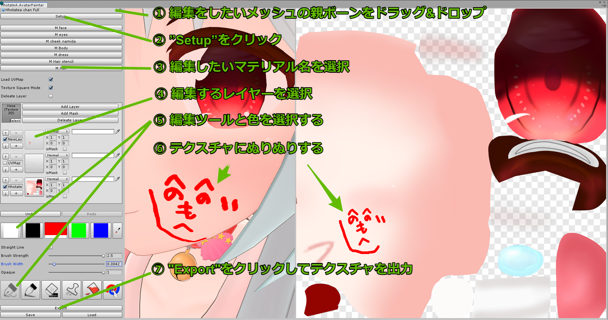
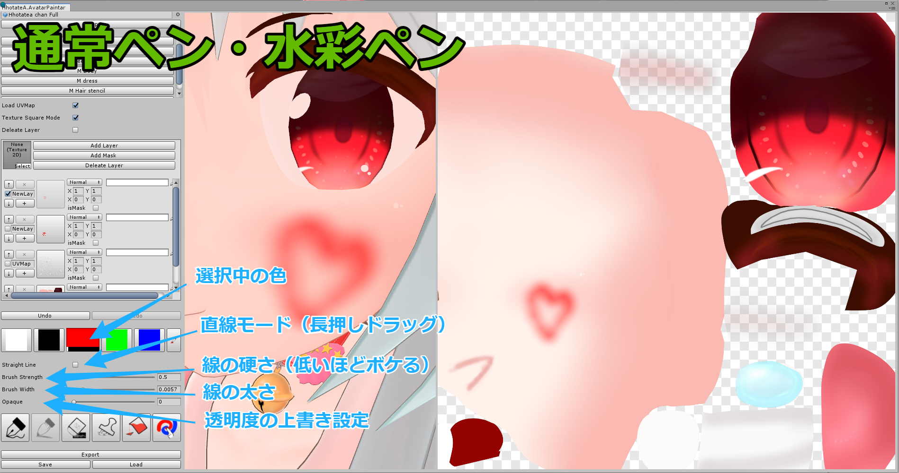
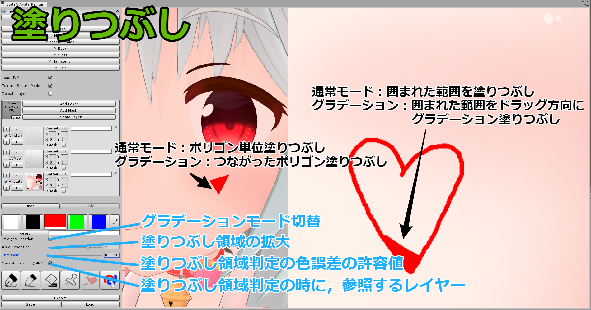
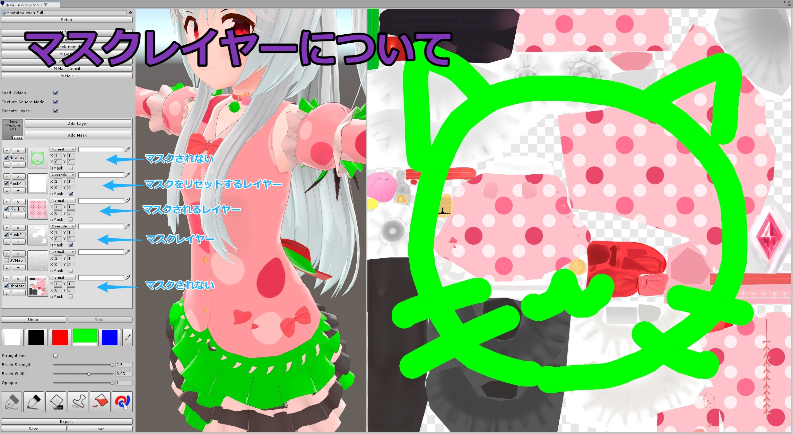
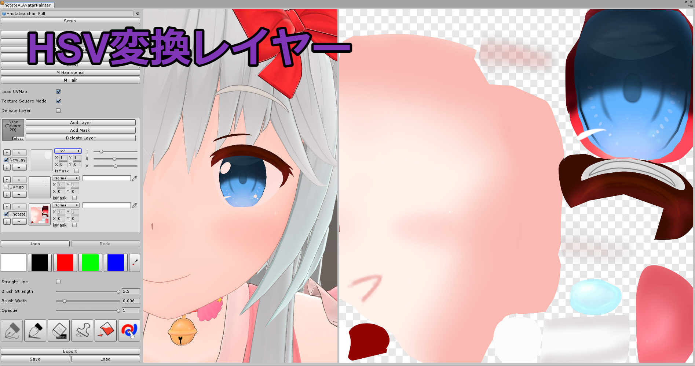
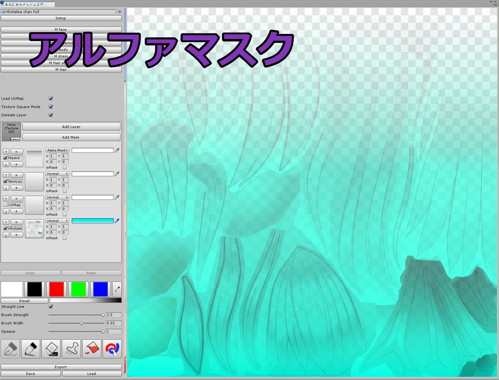
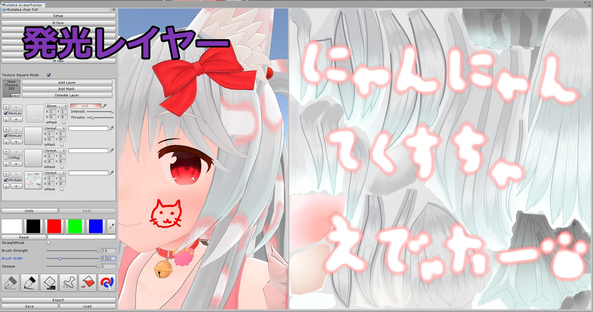

# にゃんにゃんアバターペインター(TextureModifyTool)

VRChat用アバターの色改変などを想定した，UnityのEditorで簡単なテクスチャ編集ができるツールです．

## 導入方法，使用手順
1. あらかじめアバターアップロード用プロジェクトのバックアップを取っておく．
2. TextureModifyTool.unitypackageをUnityProjectにインポートする．
3. Unityの上部メニュー，Window/HhotateA/にゃんにゃんアバターペインター(TextureModifyTool)を開く.
4. テクスチャを編集したいアバターをドラッグ&ドロップして"Setup"をクリック．
5. 編集したいマテリアル名をクリック．
6. 編集ツールを選択する．
7. アバターまたはテクスチャをぬりぬりする．
8. "Export"をクリックしてテクスチャを出力．
(9. "Save"/"Load"でレイヤー情報ごと作業内容を保存/読み込み)

## 注意事項
- バグった場合はウィンドウを一度閉じてください．編集内容は消えますが，たいていは元に戻ります．(あらかじめバックアップを取ることを忘れないでください)
- ToMeで作成したツールですので，あまりメンテナンスしないかも．
- それなりに動作が重い場合があります

## 利用規約
- アバターへの同梱，改良，ツールの一部，まるごと含め，二次配布可とします．
- 二次配布する場合，連絡とクレジット表記があるとうれしいです．(必須ではありません)
- 本ツールを使用して発生した問題に対しては製作者は一切の責任を負いません.
- VRChatやUnity等の仕様変更により本ツールの機能が使えなくなった場合、製作者は責任を負いません。

## 機能説明

アバターキャンバス : マウスホイールで拡大縮小，右クリック長押しで回転，マウスホイール長押しで移動
テクスチャキャンバス : マウスホイールで拡大縮小，マウスホイール長押しで移動

- マテリアル一覧 : 編集できるマテリアルの一覧です．メインテクスチャ("_MainTex")が設定されていないマテリアルは一覧に出ません．

- LoadUVMap : "Setup"時にモデルのUVMapを読み込むオプション
- TextureSquareMode : 有効の場合，ウィンドウ右側領域のテクスチャキャンバスが正方形になるようアバターキャンバスが変形します．そうでない場合，テクスチャキャンバスとアバターキャンバスはウィンドウ右側領域を半分ずつ使います．

- レイヤーの一覧 : 編集中のレイヤー一覧です．初期状態は下層から順番に，オリジナルのテクスチャ,UVMap,編集用新規レイヤーが登録されています．
- AddLayer : レイヤーを新規作成します．左側のフィールドにテクスチャが登録されていた場合，それを新規テクスチャとして追加します．
- AddMask : マスク設定（Override/isMask）設定されたレイヤーを追加します．カラーパレット・グラデーションが設定されていれば，その色のマスクを生成します．

- Undo : 編集をやり直します
- Redo : Undoを取り消します

- カラーパレット : ペンの色を選択できます．選択中のパレットを再度クリックすることで，色を編集できます．
- スポイトツール : ペンの色を編集中のテクスチャ/レイヤーから取得できます．

- Export : 編集したテクスチャを画像として出力します．
- Save : 編集したテクスチャをレイヤー情報ごとlayersavedata.asset(LayersSaveData:ScriptableObject)形式で保存します．
- Load : layersavedata.asset(LayersSaveData:ScriptableObject)形式のファイルから編集したレイヤー情報を復元します．

## ペンの設定

### スポイトツール
 カラーパレットで選択中の色を編集中テクスチャから抽出できます．

- Read All Layers : 無効の場合，編集中レイヤーのみの色を抽出します．

### 通常ペン・水彩ペン・消しゴム
 テクスチャに色を塗る通常のツールです．
 カラーパレットで色を選択後，アバターキャンバスかテクスチャキャンバスに左クリックで線を引けます．
 
- StraightLine : ドラッグの始点→終点へ直線の線を引けるモードです．
- BrushStrength : 線の硬さです．値が低ければ線の外側が薄く，水彩のような線が引けます．値が高ければ境目がはっきりした，油性ペンのような線になります．
- BrushWidth : 線の太さです．0の場合1pixの太さの線になります．
- Opaque : 0の場合レイヤー内で透明度が重なります．1の場合ペンがレイヤーの透明度を上書きします．

### スタンプ
 好きな画像をスタンプとして張り付けるツールです．また，編集中テクスチャの一部をスタンプとしてコピーすることもできます．
 アバターキャンバスかテクスチャキャンバスに左クリックでスタンプを押せます．
 
- Texture : スタンプとして張り付ける任意のテクスチャです．

- Copy : 編集中テクスチャの一部をスタンプとしてコピーするモードです．テクスチャキャンバスの好きな部分をドラッグの始点→終点の範囲をスタンプとして切り抜きます．
- Paste : スタンプをレイヤーに貼り付けます．

- Copy All Layers : 無効の場合"Copy"するときに編集中のレイヤーのみ参照します．

- Aspect Ratio : スタンプの縦横比です．テクスチャ参照時に自動設定されます．
- Size : スタンプの大きさです．テクスチャ参照時に自動設定されます．
- Rotation : スタンプを回転させます．

### 塗りつぶし
 テクスチャキャンバスのクリックしたところから同じ色の範囲を塗りつぶします．"StraightGradation"Modeの場合ドラッグした方向にグラデーションをつけて塗りつぶします．
 アバターキャンバスのクリックしたポリゴンを塗りつぶしします．"StraightGradation"Modeの場合ドラッグしたポリゴンと繋がったすべてのポリゴンを塗りつぶします．
 
- Straight Gradation : "StraightGradation"Modeを有効にするオプションです．
- Area Expansion : 塗りつぶしの領域を拡大します．
- Threshold : 塗りつぶし領域判定時に許容する色の誤差です．
- Mask All Texture : 無効の場合，塗りつぶし領域判定時に編集中のレイヤーのみ参照します．

### ぼかしぺん
 ペンやスタンプの境目をぼかしてなじませます．
 テクスチャキャンバスのぼかしたい部分を左クリックでぐりぐりするとぼかせます．
 
- BrushStrength : ぼかしペンの硬さです．
- BrushWidth : ぼかしペンの太さです．
- Blur Power : ぼかしの強さです．

 
## レイヤー設定

- Texture : 画像を新規レイヤーとして追加したい場合，ここに参照します．
- Add Layer : レイヤーを新規作成します．（Normal）
- Add Mask : マスク設定されたレイヤーを新規作成します．(Disable・isMask)

### マスクレイヤー(isMask)について
 isMask設定されたレイヤーがある場合，それより上層のレイヤーはすべてマスクレイヤーの影響を受けます．
 マスクレイヤーをリセットしたい場合は，白で塗りつぶされたマスク(Disable・isMask)を追加し，それより上にレイヤーを追加します．
 

### レイヤー種類ごとの設定

- Disable : 無効
- Normal : 通常合成
- Additive : 加算合成
- Multiply : 乗算合成
- Subtraction : 減算合成
- Division : 除算合成
- Bloom : 発光レイヤー
   Intensity 光り方
   Threshold 光始めるしきい値
- HSV : 色変換マスクレイヤー(HSV)
   H,S,V 色相,彩度,明度
- Color : 色変換マスクレイヤー(Color to Color)
   From 変換前の色
   To 変換後の色
   Brightness 変換後の色をなじませます
   Threshold 色を変換するしきい値です
- AlphaMask : 通明度上書きマスクレイヤー
- Override : 上書きレイヤー(下層レイヤーを無視する)

## 制作者
@HhotateA_xR
問題報告は https://github.com/HhotateA/AvatarModifyTools へ

## 更新履歴
2021/07/08 v1.2 リリース開始
2021/07/31 v1.25
2021/08/13 v1.26
2021/08/27 v1.27
2021/09/03 v1.29